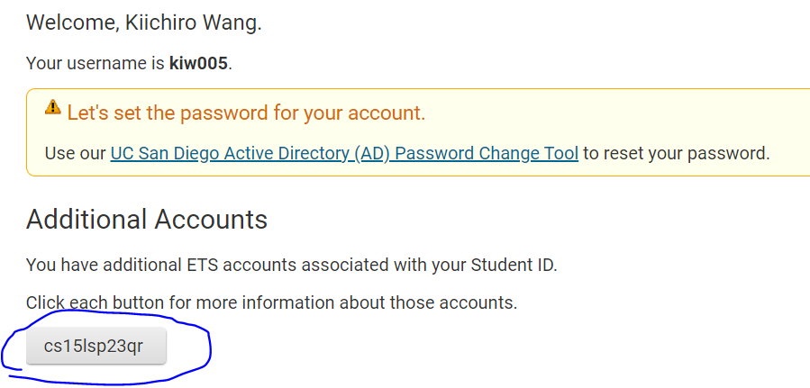
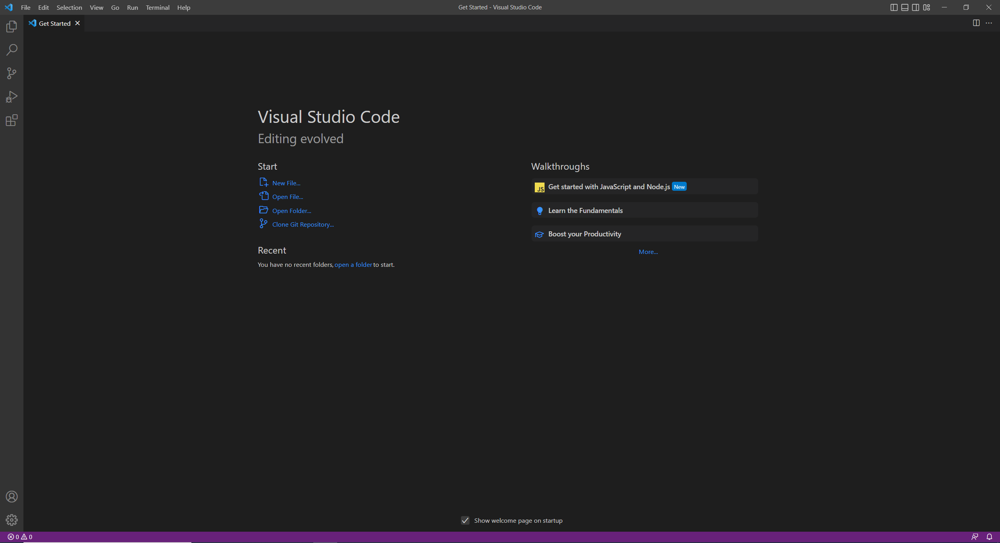
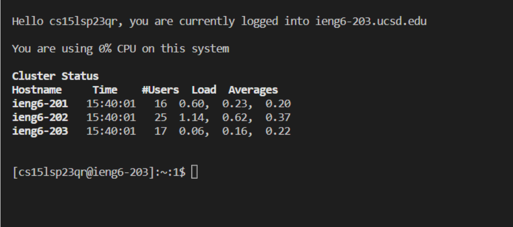

# CSE15L LAB SETUP TUTORIAL
By Kiichiro Wang


## Part 1) CSE15L Account Change

Start by looking up your account at:

[Account Lookup](https://sdacs.ucsd.edu/~icc/index.php)

There you will find under your additional accounts, your CSE15L username like this:



From there, use the **Global Password Change Tool** to then reset your password.
Here is an additional tutorial if you are still having trouble 

[Password Reset Tutorial](https://docs.google.com/document/d/1hs7CyQeh-MdUfM9uv99i8tqfneos6Y8bDU0uhn1wqho/edit)

After resetting you may have to wait a couple minutes for it to actually change.


# Part 2) Setting Up Visual Studio Code

To install Visual Studio Code, go to

[VSCode Install](https://code.visualstudio.com/)

and follow the instructions respective to your computer (Mac, Windows, etc).


Once installed open it to show a menu similar to this


From here we can move on to connecting to the ieng6 servers once we install Git.


# Part 3) Installing and Settuing up Git Bash

To install git for Windows computers follow: 

[Git Install Link](https://gitforwindows.org/)

Mac already has a preinstalled system we can use instead of git.

Once installed to begin using Bash on VScode follow these instructions:
[VSCode Git Setup](https://stackoverflow.com/questions/42606837/how-do-i-use-bash-on-windows-from-the-visual-studio-code-integrated-terminal/50527994#50527994)

Perfect, now we can remotely connect.


# Part 4) Connecting Remotely

In the newly opened git bash terminal, enter the line:

`$ ssh cs15lsp23zz@ieng6.ucsd.edu`

where the `zz` is replaced the appropriate letters of your own specific course account.

From there you may get the following message
`The authenticity of host 'ieng6.ucsd.edu (128.54.70.227)' can't be established.
RSA key fingerprint is SHA256:ksruYwhnYH+sySHnHAtLUHngrPEyZTDl/1x99wUQcec.
Are you sure you want to continue connecting (yes/no/[fingerprint])?`

Say **yes** and then proceed to enter your password.

**WARNING**:
What you type will not show up as it will be hidden to protect your password. However,
you are actually typing so still enter your password like normal and press enter.

Now hopefully your terminal will look a little like this




# Part 5) Entering Commands

Now you can finally play around and enter some commands. Here are some to start off with:

```
cd ~
cd
ls -lat
ls -a
ls <directory> where <directory> is /home/linux/ieng6/cs15lsp23/cs15lsp23abc, where the abc is one of the other group members’ username
cp /home/linux/ieng6/cs15lsp23/public/hello.txt ~/
cat /home/linux/ieng6/cs15lsp23/public/hello.txt
```


Hopefully now your are all setup. `Woooo :D`
